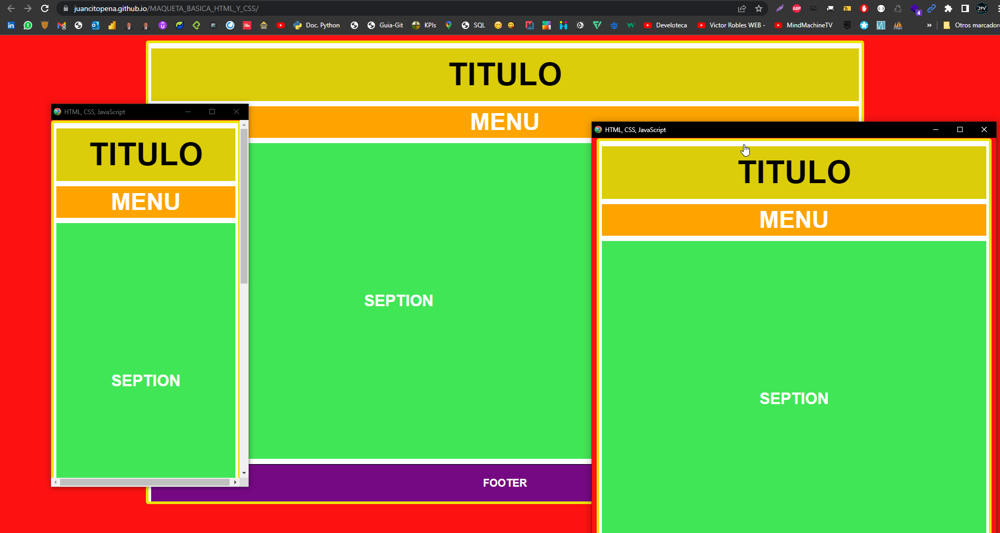

# TERCER PROYECTO: MAQUETA BÁSICA HTML Y CSS RESPONSIVE

Este proyecto es una maqueta básica de una página web con capacidad de respuesta (responsive design). Utiliza elementos semánticos de HTML como `header`, `nav`, `article`, `aside` y `footer`, junto con un diseño adaptable para dispositivos móviles.

## Contenido del Proyecto

- **index.html**: Archivo HTML principal que representa la estructura básica de la página web con etiquetas semánticas y diseño responsive.
- **css/**: Carpeta que contiene la hoja de estilo (`style.css`) para estilizar la página HTML.
- **imagen/**: Carpeta que contiene imágenes utilizadas en la página, como el logotipo y capturas de pantalla.

## Estructura de la Página

La página HTML utiliza etiquetas semánticas para organizar el contenido:

- El `<header>` contiene la cabecera de la página.
- La etiqueta `<nav>` representa la barra de navegación.
- El contenido principal se encuentra dentro de un `<article>`.
- El `<aside>` se utiliza para contenido relacionado o secundario.
- El `<footer>` contiene el pie de página.

## Diseño Responsivo

El diseño es responsive, lo que significa que la página se adaptará automáticamente al tamaño de la pantalla del dispositivo, proporcionando una experiencia óptima tanto en computadoras de escritorio como en dispositivos móviles.

# CAPTURAS DE PANTALLA:




## Cómo Usar

1. Clona este repositorio en tu máquina local:

```bash
git clone https://github.com/tuusuario/TERCER_PROYECTO_MAQUETA_BASICA_HTML_Y_CSS-RESPONSIVE.git
